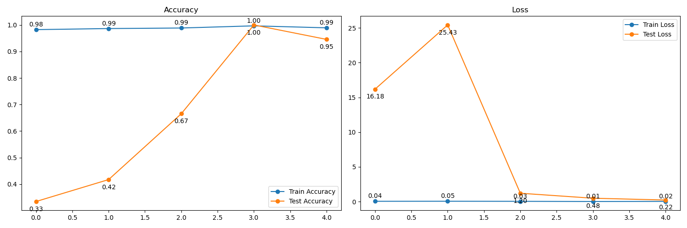

# FruitClassifier
Este é um projeto de classificação de frutas utilizando uma rede neural convolucional (CNN) baseada na arquitetura ResNet18. O objetivo do projeto é classificar imagens de frutas em diferentes categorias. Este repositório contém o código necessário para treinar e avaliar o modelo, além de visualizações de resultados.

o dataset utilizada está disponível no [Kaggle](https://www.kaggle.com/datasets/moltean/fruits), para este trabalho utilizou-se a pasta contendo imagens de dimensão (100x100).

## Tabela de Conteúdos
1. [Estrutura do Repositório](#estrutura-do-repositório)
2. [Como Executar](#como-executar)
    - [1. Preparar os Dados](#1-preparar-os-dados)
    - [2. Treinando o Modelo](#2-treinando-o-modelo)
3. [Pré-processamento dos Dados](#pré-processamento-dos-dados)
4. [Visualizando os Resultados](#visualizando-os-resultados)
5. [Arquitetura do Modelo](#arquitetura-do-modelo)
)
2. [Como Executar](#como-executar)
    - [1. Preparar os Dados](#1-preparar-os-dados)
    - [2. Treinando o Modelo](#2-treinando-o-modelo)
3. [Pré-processamento dos Dados](#pré-processamento-dos-dados)
4. [Visualizando os Resultados](#visualizando-os-resultados)
5. [Arquitetura do Modelo](#arquitetura-do-modelo)


# Estrutura do Repositório
```bash
FruitClassifier/
├── src/                        # Código fonte do projeto
│   ├── __init__.py             # Arquivo de inicialização do pacote
│   ├── main.py                 # Script principal para treinar e avaliar o modelo
│   ├── load_data.py            # Classe e funções para carregar e pré-processar os dados
│   ├── cnn_model.py            # Definição do modelo CNN (ResNet18 ajustada)
│   ├── training_utils.py       # Funções utilitárias para treinamento e avaliação
│   ├── visualization_utils.py  # Funções para gerar gráficos e visualizações
│   └── ...                     # Outros scripts auxiliares
│
├── data/                        # Dados do projeto 
│   └── fruits-360_dataset_100x100/ # Dataset com imagens das frutas (100x100 pixels)
│       ├── Test/               # Conjunto de teste com subpastas para cada classe
│       └── Training/           # Conjunto de treino com subpastas para cada classe
│
├── imgs/                        # Imagens geradas durante o processo (gráficos e resultados)
│   ├── fruits.png              # Exemplo de frutas no conjunto de treinamento
│   ├── loss_acc.png            # Gráficos de loss e acurácia durante o treinamento
│   └── results.png             # Exemplos de previsões no conjunto de teste
│
├── requirements.txt             # Lista de dependências do projeto
├── README.md                    # Documentação do projeto

```

# Como Executar
 1. **Preparar os Dados**

Certifique-se de ter o conjunto de dados Fruits 360 Dataset baixado e descompactado na pasta data/fruits-360_dataset/.


 2. **Treinando o Modelo**
O script main.py é o ponto de entrada para treinar o modelo. Ele carrega os dados, define os hiperparâmetros, treina o modelo e salva os resultados.

Para treinar o modelo, execute:
```bash
python3 src/main.py
```
Este script irá:
- Carregar os dados de treinamento e teste.
- Definir a arquitetura do modelo (ResNet18).
- Treinar o modelo por um número de épocas definido.
- Salvar o modelo treinado na pasta model/.
- Gerar gráficos de desempenho (acurácia e loss) e visualizações de exemplos.

## Pré-processamento dos Dados
O pré-processamento dos dados é realizado no arquivo `load_data.py`, no qual é implementada a classe `Data`. Lá ocorrem as seguintes etapas:

1. **Filtragem de Diretórios**:
   - São selecionados os diretórios contendo as imagens das 3 frutas escolhidas, tanto para os arquivos de treino quanto de teste.

2. **Data Augmentation**:
   - São aplicadas as seguintes transformações nos dados de treinamento:
     - **Resize (224, 224)**: Redimensiona as imagens para o tamanho fixo de 224x224 pixels, garantindo compatibilidade com a entrada da ResNet-18.
     - **RandomHorizontalFlip()**: Realiza uma inversão horizontal aleatória com uma probabilidade de 50%.
     - **RandomRotation(10)**: Rotaciona a imagem aleatoriamente em um intervalo de -10 a 10 graus.
     - **RandomVerticalFlip()**: Realiza uma inversão vertical aleatória com uma probabilidade de 50%.
     - **ToTensor()**: Converte as imagens para tensores PyTorch.

3. **Extração de Caminhos e Labels**:
   - Os caminhos das imagens são armazenados na lista `self.image_paths`.
   - Os labels correspondentes são armazenados na lista `self.labels`.


## Visualizando os Resultados
Após o treinamento, o script main.py também irá gerar gráficos e salvar os resultados na pasta imgs/. O diretório imgs/ conterá imagens como:

- Visualizações das frutas no conjunto de treinamento(fruits.png).
- Gráficos de acurácia e loss durante o treinamento(loss_acc.png).
- Resultados das previsões no conjunto de teste(results.png).

# Arquitetura do Modelo
O modelo utilizado neste projeto é baseado na `ResNet-18`, uma arquitetura de rede neural convolucional residual amplamente utilizada em tarefas de classificação de imagens. A `ResNet-18` é conhecida por sua eficiência e capacidade de aprendizado profundo devido ao uso de conexões residuais, que ajudam a mitigar o problema do gradiente desvanecente em redes profundas.

## Modificações para a Tarefa
Para adaptar a `ResNet-18` à tarefa de classificação de frutas, algumas alterações foram feitas:
1. **Camada Final Personalizada**: 
   - A última camada totalmente conectada da rede foi substituída por uma camada linear personalizada para permitir a classificação em **3 classes** (uma para cada tipo de fruta escolhido).
   - A nova camada é definida com:
     ```python
     nn.Linear(in_features, num_classes)
     ```
     onde `in_features` representa o número de entradas da camada anterior (específico da ResNet-18) e `num_classes` é igual a 3.

2. **Transfer Learning**:
   - Os pesos da `ResNet-18` foram inicializados utilizando um modelo pré-treinado no dataset **ImageNet**. Isso permite que o modelo aproveite as características aprendidas em milhões de imagens genéricas e as aplique ao conjunto de dados de frutas.
   - Durante o treinamento, os pesos das camadas convolucionais foram ajustados (fine-tuning) para refinar as representações aprendidas com base nas frutas do dataset `Fruits 360`.

3. **Compatibilidade com os Dados**:
   - As imagens do conjunto de dados foram redimensionadas para 224x224 pixels, garantindo compatibilidade com a entrada esperada pela `ResNet-18`.
   - A normalização dos dados foi realizada para alinhar as imagens aos valores utilizados na rede pré-treinada.

## Vantagens da ResNet-18 no Projeto
- **Eficiência Computacional**: A ResNet-18 é relativamente leve e pode ser treinada em tempos razoáveis, mesmo em GPUs moderadas.
- **Generalização**: O uso de um modelo pré-treinado melhora a capacidade de generalização da rede, especialmente em datasets menores como o `Fruits 360`.
- **Redução de Overfitting**: A utilização de conexões residuais e data augmentation ajuda a evitar que o modelo memorize os dados de treinamento, melhorando o desempenho no conjunto de teste.

A combinação dessas características faz da `ResNet-18` uma escolha ideal para este projeto, equilibrando desempenho e eficiência em termos de treinamento e inferência.

# Resultados

Como o conjunto de dados obtidos após a seleção dos três tipos de frutas é pequeno, 1472 e 496 imagens para treinamento e teste respectivamente, mesmo considerando as transformaçoes realizadas nas imagens durante a etapa de treinamento, o modelo conseguiu obter **100% de acurácia** nos casos de treino e teste com apenas 3 épocas de treinamento.

Abaixo são apresentados os gráficos da perda e da acurácia do modelo para cada uma das épocas:


Por fim apresentamos uma amostra aleatória de 25 frutas do conjunto de teste, cada uma das imagens é acompanhada do seu rótulo verdadeiro e o rótulo predito pelo modelo.

